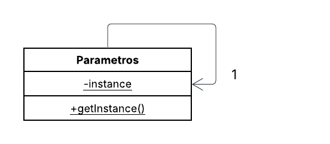

# 💇‍♀️ Sistema de Agendamento de Serviços de Beleza

Meu objetivo com este código é implementar o padrão Singleton para gerenciar e manter o estado atual da minha aplicação (o servicoAgendadoSalao e o cliente), garantindo que exista apenas uma instância dessa informação de "parâmetros" ou "sessão" em todo o sistema.

## 📌 Diagrama de Classes

## 👩‍💻 Autora

**Eduarda Araujo Carvalho**  
